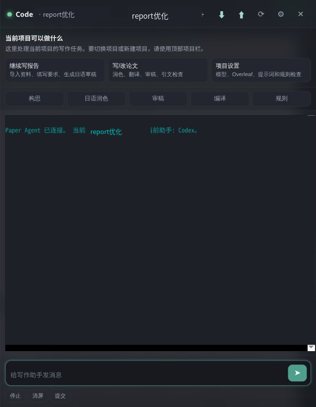

# Paper Agent

Paper Agent 是一个本机运行的论文 / 报告写作工作台。它把 Overleaf、本地 LaTeX 项目、AI 写作助手和资料检索模块放在同一个界面里，适合个人在本机管理课程报告、论文草稿、审稿修改和 Overleaf 同步。

> 默认只监听 `127.0.0.1` / `localhost`。当前版本面向个人本机使用，不建议直接暴露到公网。

中文图文教程： [docs/tutorial.zh-CN.md](docs/tutorial.zh-CN.md)

## 主要功能

- 多项目管理：每个项目都有独立目录、规则、提示词、资料库和 agent 设置。
- 本机 Overleaf 集成：支持从 Overleaf 拉取、把本地文件推送回 Overleaf。
- 多种助手后端：支持 Codex、Claude Code、OpenAI-compatible API、自定义命令行 agent。
- 写作快捷动作：构思、润色、翻译、审稿、编译、规则检查。
- 项目隔离：切换项目时隔离工作目录、Codex 状态、模块数据和 prompt，避免上下文串线。
- 内置 Japanese Style RAG：用于日语课程报告，支持导入课件、讲义、教材、旧作业、评分要求，生成并检查日语草稿。
- 修改后审核：agent 改文件后可以自动触发只读审核，检查是否越界或违反项目规则。

## 快速开始

```bash
git clone https://github.com/kazehana99k/paper-agent.git
cd paper-agent
npm install
cp config.example.json config.json
npm start
```

打开：

```text
http://127.0.0.1:8080/__agent/
```

如果 `8080` 端口被占用，可以修改 `config.json` 里的 `port`。

## 第一次使用

界面右下角有两个入口：

- `写作助手`：聊天、快捷 prompt、编译、审稿、Overleaf 拉取 / 推送。
- `日语报告`：资料导入、资料索引、日语草稿生成、日语表达检查。



点击顶部 `+` 可以新建项目。当前支持：

- `课程报告`：适合日语レポート、课程作业、实验报告。默认启用 Japanese Style RAG。
- `论文项目`：适合 LaTeX / Overleaf 论文，默认启用论文写作、润色、翻译、审稿、引文检查和编译流程。
- `普通 LaTeX 项目`：适合不想套论文或课程报告规则的文档。

新建课程报告项目会自动生成：

```text
<project>/
  .paper-agent/project.json
  AGENTS.md
  main.tex
  references.bib
  figures/
  materials/
  reviews/
  outputs/
  tools/
    compile.mjs
    lint.mjs
    paper-agent-api.mjs
```

其中 `.paper-agent/project.json` 会记录项目类型、Overleaf 绑定、启用模块、同步路径和 prompt 覆盖规则。

## 配置

`config.json` 不会提交到 Git，因为里面可能包含 Overleaf 账号、API key 和本机路径。

常用字段：

- `overleafUrl`：本机 Overleaf 地址。
- `email` / `password`：Overleaf 登录信息，用于 iframe 自动登录和同步。
- `agents`：Codex、Claude Code、API 助手、自定义命令的配置。
- `projects[]`：项目列表。
- `projects[].agentProvider`：当前项目默认使用哪个助手。
- `projects[].modules`：当前项目启用哪些模块。
- `projects[].promptSet`：界面上显示哪些快捷 prompt。
- `projects[].audit.enabled`：agent 修改后是否自动审核。

Provider 说明：

| Provider | 用途 |
|---|---|
| Codex | 默认主力助手，在当前项目目录内运行，适合写作、改稿、编译、查文件 |
| Claude Code | 可选命令行助手，取决于本机 Claude Code 安装和权限模式 |
| API 助手 | OpenAI-compatible 文本接口，只返回文本，不直接改文件 |
| 自定义命令 | 任意本机 CLI，可用 stdin、参数或 prompt 文件传入任务 |

## Japanese Style RAG

Japanese Style RAG 是内置模块，不是全局 skill，也不是单独论文项目。它通过 Paper Agent 后端提供这些能力：

- 导入单个文件或文件夹。
- 给资料选择中文分类：课件、讲义、教材、旧作业、评分要求、论文、公开报告、个人笔记。
- 建立文本分块、索引和 embedding。
- 根据课程资料生成日语报告草稿。
- 检查草稿是否存在无来源事实、资料原文重复、引用风险和日语表达问题。

模块源码在：

```text
modules/japanese-style-rag/project
```

每个项目自己的资料库、索引、embedding 和最新草稿会保存在当前项目下：

```text
<project>/.paper-agent/modules/japanese-style-rag/
```

这样刷新页面或切换项目后，资料和草稿不会丢。该目录默认被项目 `.gitignore` 忽略，因为里面通常包含课程 PDF、旧作业、生成草稿和向量索引。

## Overleaf 同步

每个项目目录都有 `.paper-agent/project.json`。执行拉取 / 推送前，Paper Agent 会检查这个项目标记，避免把 A 项目的 Overleaf 内容写进 B 项目目录。

默认推送路径：

```text
main.tex
references.bib
figures
```

同步安全规则：

- 不允许推送绝对路径。
- 不允许推送 `..` 越界路径。
- 不允许推送 `.paper-agent/`、`.git/`、`.env`、`node_modules/`、runtime 数据。
- `pull` 会跳过非写作白名单文件。
- 每次同步会记录到 `.paper-agent/sync-log.jsonl`。

本机 Overleaf 推荐使用官方 Overleaf Toolkit 部署：

- [Overleaf Toolkit Quick-Start Guide](https://github.com/overleaf/toolkit/blob/master/doc/quick-start-guide.md)
- [What is the Overleaf Toolkit?](https://docs.overleaf.com/on-premises/getting-started/what-is-the-overleaf-toolkit)

## 目录结构

```text
paper-agent/
  lib/                            项目、安全和路径契约
  public/                         浏览器界面
  server.js                       本机服务和 agent runner
  modules/
    brainstorm/                   构思模块
    japanese-style-rag/project/   内置日语报告 RAG 模块
  runtime/                        本机运行时数据，Git 忽略
  projects/                       新建项目目录，Git 忽略
  config.json                     本机配置，Git 忽略
```

## 开发与检查

Node 层：

```bash
npm test
```

Japanese Style RAG 模块：

```bash
cd modules/japanese-style-rag/project
PYTHONPATH=src python -m pytest
```

如果使用 `uv`：

```bash
cd modules/japanese-style-rag/project
uv sync --extra dev
uv run pytest
uv run python scripts/eval_guardrails.py
```

发布或打包前，确认不要提交：

- `config.json`
- `.env`
- `runtime/`
- `projects/`
- `node_modules/`
- `server.log`
- 课程 PDF、旧作业、生成草稿、embedding 缓存
- Overleaf 密码、API key、cookie、session

可以用下面命令做基础检查：

```bash
npm test
npm pack --dry-run --json
```

## License

MIT
