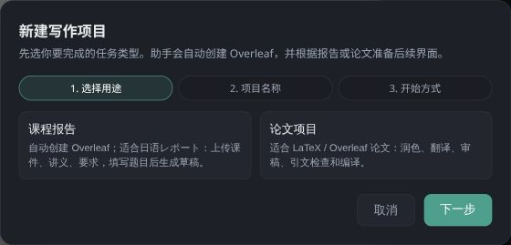
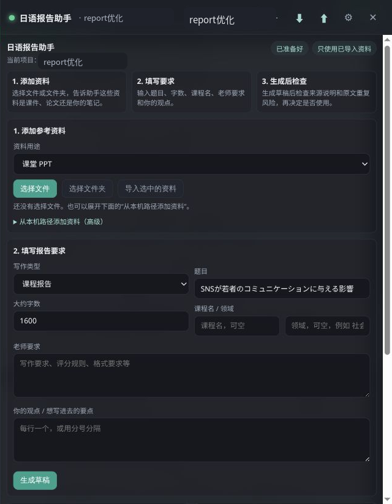

# Paper Agent 中文图文教程

这份教程面向第一次下载 Paper Agent 的用户。目标是把它作为一个本机写作工作台使用：右侧是 AI 写作助手和日语报告助手，左侧可以嵌入本机 Overleaf。

Paper Agent 默认只监听 `127.0.0.1` / `localhost`，适合个人本机使用。它不是公网多用户系统，也不建议直接暴露到公网。

## 1. 它能做什么

Paper Agent 把几个写作流程放在同一个界面里：

- 管理多个写作项目，每个项目都有自己的目录、规则、提示词和 agent 设置。
- 连接本机 Overleaf，实现 `pull` / `push`，把 Overleaf 项目和本地 LaTeX 文件同步。
- 调用 Codex、Claude Code、OpenAI-compatible API 或自定义命令行 agent。
- 提供快捷动作：构思、润色、翻译、审稿、编译、规则检查。
- 内置 Japanese Style RAG 模块，用于日语课程报告：导入课件、讲义、旧作业、评分要求，生成并检查日语草稿。
- 自动隔离项目上下文，避免 A 项目的论文规则污染 B 项目的报告。

## 2. 安装

### 2.1 环境要求

推荐环境：

- Node.js 20+。
- npm。
- 可选：本机 Overleaf。
- 可选：Codex CLI、Claude Code 或任意 OpenAI-compatible API。
- 可选：Python 3，用于 Japanese Style RAG 模块。
- 可选：TeX Live / MiKTeX / MacTeX，用于本机编译 LaTeX。

如果你没有本机 TeX，也可以只在 Overleaf 里编译。Paper Agent 的 `tools/compile.mjs` 会提示缺少本机编译器，而不会把这当成程序崩溃。

### 2.2 下载和启动

```bash
git clone https://github.com/<your-name>/paper-agent.git
cd paper-agent
npm install
cp config.example.json config.json
npm start
```

打开：

```text
http://127.0.0.1:8080/__agent/
```

如果端口被占用，可以修改 `config.json` 里的 `port`。

## 3. 第一次打开界面

右下角有两个入口：

- `写作助手`：聊天、快捷 prompt、编译、审稿、推送和拉取。
- `日语报告`：Japanese Style RAG 工作台，专门处理资料导入、资料检索、日语草稿生成和检查。


界面上方从左到右分别是：

- 当前助手：例如 Codex、Claude Code、API 助手。
- 当前项目：切换项目或选择 Overleaf 项目。
- `+`：新建项目。
- `⬇`：从 Overleaf 拉取到本地。
- `⬆`：从本地推送到 Overleaf。
- `⟳`：重启写作助手会话。
- `⚙`：打开设置。

## 4. 新建项目

点击顶部 `+`，进入新建项目向导。



第一步选择项目类型：

- `课程报告`：适合日语レポート、课程作业、实验报告。默认启用 Japanese Style RAG。
- `论文项目`：适合 LaTeX / Overleaf 论文。默认启用论文写作、润色、翻译、审稿、引文检查和编译流程。

课程报告项目会自动准备：

```text
<project>/
  .paper-agent/project.json
  AGENTS.md
  main.tex
  references.bib
  figures/
  materials/
  reviews/
  outputs/
  tools/
    compile.mjs
    lint.mjs
    paper-agent-api.mjs
```

其中：

- `.paper-agent/project.json` 固化项目类型、Overleaf 绑定、启用模块和同步路径。
- `AGENTS.md` 是当前项目的规则文件，agent 会优先读取它。
- `tools/compile.mjs` 是跨平台编译入口。
- `tools/lint.mjs` 做基础结构检查。
- `tools/paper-agent-api.mjs` 给 agent 调用 Paper Agent API，不需要手写 `curl`。

## 5. 项目隔离逻辑

Paper Agent 的一个重要设计是：项目之间不能混上下文。

切换项目后：

- Agent 工作目录会切到当前项目目录。
- Codex 的 `CODEX_HOME` 会按项目隔离。
- Japanese Style RAG 的资料库固定在当前项目下。
- Overleaf `pull` / `push` 会检查 `.paper-agent/project.json`，避免把 A 项目的 Overleaf 拉到 B 项目目录。
- Prompt 渲染会显式带上 `projectId`。

在提示词和终端输出里，路径会显示成逻辑路径：

```text
<project>/.paper-agent/modules/japanese-style-rag/...
<paper-agent>/modules/japanese-style-rag/project
```

真实绝对路径只在服务器内部使用，不会写进 prompt。这样别人下载仓库后不会看到开发者机器上的 `/mnt/...` 或 `/home/...` 路径。

## 6. 写作助手怎么用

打开 `写作助手` 后，可以直接在底部输入框发消息，也可以点快捷按钮。

常用快捷动作：

- `构思`：整理项目目标、论文故事或报告结构。
- `润色` / `日语润色`：按当前项目类型润色正文。
- `翻译`：把中文论文段落翻译成英文论文写法。
- `审稿`：按项目类型审查。课程报告不会套 CVPR/TPAMI 规则，论文项目才走论文审稿逻辑。
- `编译`：运行当前项目的编译和检查脚本。
- `规则`：只读审核本次修改是否越界。

快捷动作会渲染成完整 prompt 交给当前 agent。按住 `Shift` 再点快捷动作，可以只把 prompt 填到输入框里，先人工修改再发送。

## 7. Japanese Style RAG 工作台

课程报告项目默认启用日语报告助手。



推荐流程：

1. 添加资料。
   - 选择单个文件或文件夹。
   - 选择资料类型，例如课件、讲义、作业说明、教材、旧作业、论文、公开报告、自己的笔记。
2. 读取资料。
   - 点击 `读取资料`，模块会提取文本、分块、建立索引和 embedding。
3. 填写报告要求。
   - 写题目、字数、课程名、老师要求、评分规则和自己的观点。
4. 生成草稿。
   - 点击 `生成草稿`。
   - 草稿会同步保存到 `outputs/japanese-style-rag/latest-draft.md`。
5. 检查草稿。
   - 点击 `检查草稿`，检查无来源事实、资料原文重复和引用风险。

资料分类含义：

| 中文名称 | 内部类型 | 用途 |
|---|---|---|
| 作业要求 / 评分标准 | `report_template` | 只用于结构和格式，不当事实来源 |
| 课堂 PPT | `course_slide` | 支撑课程内容和术语 |
| 讲义 / 课堂笔记 | `lecture_note` | 支撑讲解框架 |
| 作业说明 / 课程资料 | `course_handout` | 支撑题目要求和评分点 |
| 教材 / 书籍 | `book` | 支撑定义、定理和理论背景 |
| 学术论文 / 先行研究 | `academic_paper` | 支撑相关研究 |
| 公开报告 / 白皮书 | `public_report` | 支撑背景和统计资料 |
| 我的观点 / 笔记 | `user_note` | 作为个人观点，不当事实来源 |

注意：`report_template` 只能当格式模板，不能当事实来源。这是为了避免把旧作业或模板里的内容误当成本次报告的事实依据。

## 8. 设置助手和模型

点击顶部 `⚙` 打开设置。

可以配置：

- Overleaf 邮箱和密码。
- 当前项目显示名。
- Overleaf 项目名。
- 本地项目目录。
- 推送路径。
- Agent Provider。
- 模型。
- 自动规则检查。
- Prompt 模板。

Agent Provider 说明：

| Provider | 说明 |
|---|---|
| Codex | 默认主力助手，运行在当前项目目录 |
| Claude Code | 可选命令行助手 |
| API 助手 | OpenAI-compatible `/chat/completions` 文本接口 |
| 自定义命令 | 任何本机 CLI，支持 `stdin`、参数或 prompt 文件 |

Codex / Claude Code 只需要选择 provider 和模型。只有选择 API 助手时，界面才会显示 API Base URL 和 API Key 环境变量。

## 9. Overleaf 同步

如果项目绑定了 Overleaf：

- `⬇`：从 Overleaf 拉取到本地。
- `⬆`：把本地 `pushPaths` 中的文件推送到 Overleaf。

默认推送路径：

```text
main.tex
references.bib
figures
```

安全限制：

- 不允许推送绝对路径。
- 不允许推送 `..` 越界路径。
- 不允许推送 `.paper-agent/`、`.git/`、`.env`、`node_modules/`、runtime 数据。
- `pull` 会跳过非写作白名单文件。
- 每次同步会写入 `.paper-agent/sync-log.jsonl`，便于审计。

如果看到 token 失效提示，正常情况下前端会自动重新取本机 token 并重试。手动刷新页面只是兜底方案，不应该是常规操作。

## 10. 本机 Overleaf 部署简单说明

Paper Agent 默认假设你有一个本机 Overleaf，地址类似：

```json
{
  "overleafUrl": "http://127.0.0.1:80"
}
```

推荐用官方 Overleaf Toolkit 部署。官方 Quick Start 说明了它依赖 `bash` 和 `docker`，并用脚本包装 `docker compose` 管理 Overleaf 容器：

- 官方文档：[Overleaf Toolkit Quick-Start Guide](https://github.com/overleaf/toolkit/blob/master/doc/quick-start-guide.md)
- 官方说明：[What is the Overleaf Toolkit?](https://docs.overleaf.com/on-premises/getting-started/what-is-the-overleaf-toolkit)

最小流程大致是：

```bash
git clone https://github.com/overleaf/toolkit.git ./overleaf-toolkit
cd ./overleaf-toolkit
bin/init
bin/up
```

然后打开：

```text
http://localhost/launchpad
```

创建第一个管理员账户后，在 Paper Agent 的 `config.json` 中配置：

```json
{
  "overleafUrl": "http://127.0.0.1:80",
  "email": "your-overleaf-email@example.com",
  "password": "your-overleaf-password"
}
```

后续常用命令：

```bash
cd overleaf-toolkit
bin/start
bin/stop
bin/logs -f web
bin/doctor
```

说明：

- 这只是本地开发/个人使用的部署提示。
- 如果要公网部署 Overleaf，需要自己处理 HTTPS、备份、账户、邮件、反向代理和服务器安全。
- Paper Agent 目前也按本机私有使用设计，不建议和 Overleaf 一起直接暴露公网。

## 11. 发布到 GitHub 前检查

不要提交这些内容：

- `config.json`
- `.env`
- `runtime/`
- `node_modules/`
- `projects/`
- `backups/`
- `.paper-agent/modules/`
- 课程 PDF、旧作业、生成草稿、embedding 缓存
- Overleaf 密码、API key、cookie、session

检查命令：

```bash
git status --short
npm test
npm pack --dry-run --json
```

`npm pack --dry-run --json` 中不应该出现：

```text
runtime/
projects/
config.json
.env
.paper-agent/
data/source_corpus/
```

如果你第一次上传 GitHub，可以按这个流程：

```bash
git init
git add README.md docs/ public/ lib/ modules/ server.js package.json package-lock.json config.example.json SECURITY.md CONTRIBUTING.md LICENSE .gitignore .npmignore
git status --short
git commit -m "Initial Paper Agent release"
git branch -M main
git remote add origin git@github.com:<your-name>/paper-agent.git
git push -u origin main
```

如果 `git status` 里出现了私有资料，先停下来，不要提交。

## 12. 常见问题

### 12.1 为什么没有本机编译？

你没有安装 `latexmk` 或 `xelatex`。可以：

- 安装 TeX Live / MiKTeX / MacTeX。
- 或者继续用 Overleaf 编译。

项目里的 `node tools/compile.mjs` 会自动检查本机是否有编译器。

### 12.2 为什么日语报告助手没有资料？

先导入资料，再点击 `读取资料`。如果已经生成过草稿，项目会把最近草稿保存在：

```text
outputs/japanese-style-rag/latest-draft.md
outputs/japanese-style-rag/latest-draft.json
```

### 12.3 为什么 API 助手不能改文件？

API 助手是纯文本接口。它不能自己运行命令、读取文件或写文件。需要改文件时，用 Codex、Claude Code 或自定义 CLI agent。

### 12.4 为什么不同项目不能共享上下文？

这是故意设计。论文项目、课程报告、普通 LaTeX 项目的审稿标准不同。强行共享上下文会导致 prompt 污染，比如把某篇论文的专属规则套到课程报告上。

### 12.5 Windows 能不能跑？

核心 Node 服务和项目内工具已经按跨平台方式写：

- `node tools/compile.mjs`
- `node tools/lint.mjs`
- `node tools/paper-agent-api.mjs`

仍需要注意：

- 本机 LaTeX 要装 MiKTeX 或 TeX Live，并把命令加入 PATH。
- Python venv 在 Windows 下会走 `.venv\\Scripts\\python.exe`。
- `llama.cpp` 本地模型服务需要单独准备 Windows 可执行文件，不能直接复用 Linux build。

